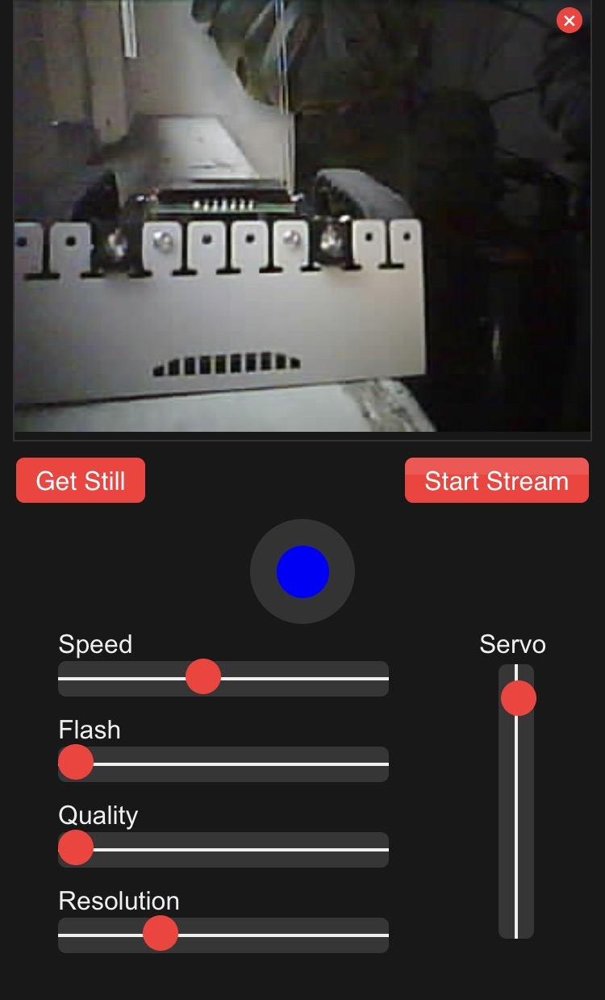

# ESP32CAM-Robot

Esp32 controlling tracked vehicle while streaming video, tilt servo and flashlight.
Serial console tells you where to connect. 
The uncompressed html code is included. It also contain a Button variante.

Flashing:

Screenshot iPhone:

Build:

ESP-Cam, motor driver, servo, Zumo Chassis.

