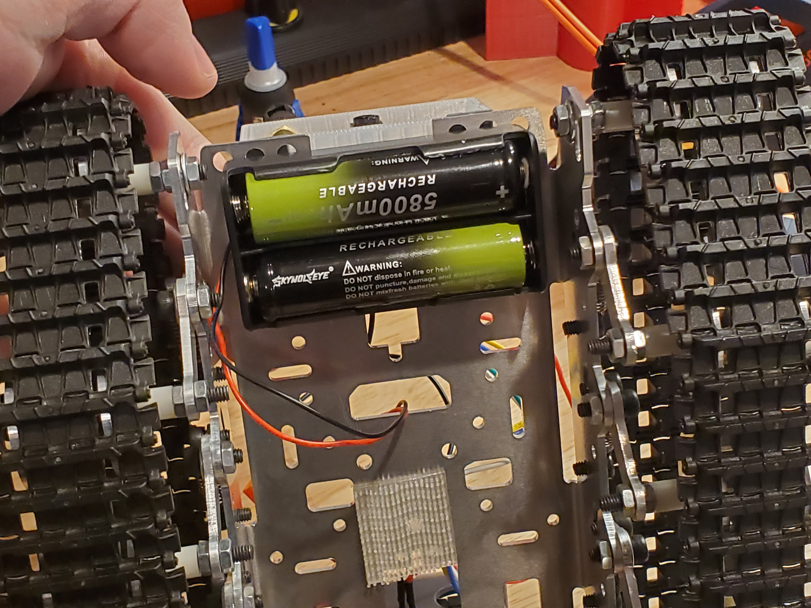
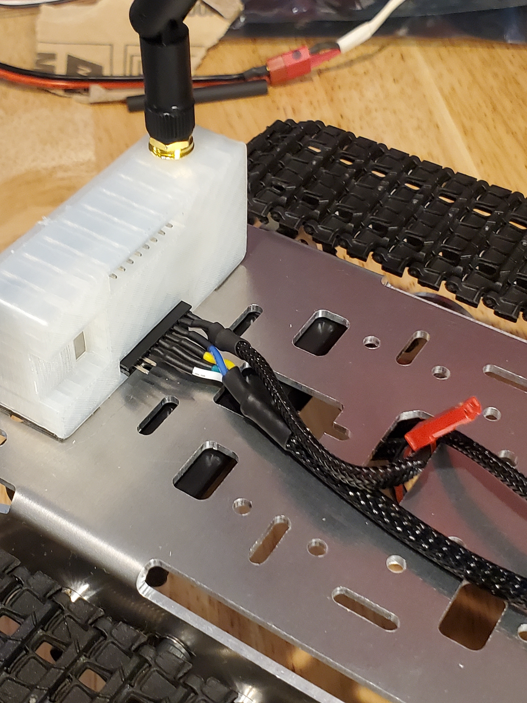

# ESP32CAM-Robot

Esp32 controlling tracked vehicle while streaming video and providing a flashlight.
Serial console tells you where to connect.
The uncompressed html code is included.

The joystick on the web interface provides proportional which makes the robot far more controllable than with a button or bang/bang control.

ESP32-CAM, L298N motor driver module, generic cheap treaded platform. The ESP32-CAM is powered from the L298N module's 5V regulator. The L298N works with 2S-3S lithium based batteries

Batteries:

Connections on back of ESP32-CAM:

Screenshot of Web Interface:

